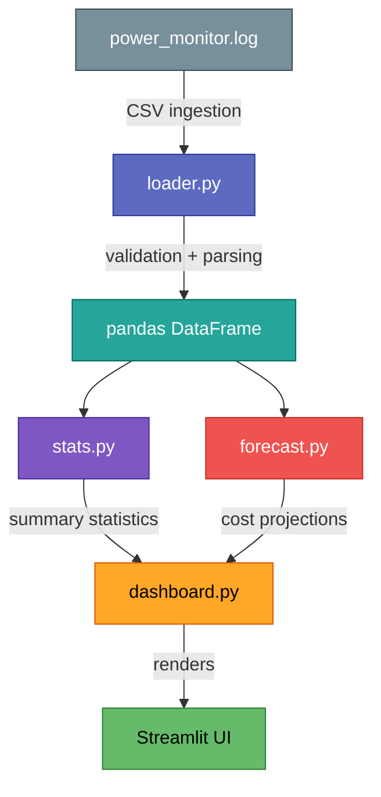

# Power Cost Project

## Overview

Power Cost is a data-driven tool that analyses real laptop power consumption
logs and forecasts the monthly electricity cost of running the machine 24/7.

The raw data comes from an external power monitor that writes a CSV log
(`/mnt/Data/scripts/power_monitor/logs/power_monitor.log`) every minute with
the columns `Timestamp`, `CPU_Watts`, and `GPU_Watts`.

## Technology Stack

| Layer            | Choice                     |
|------------------|----------------------------|
| Language         | Python 3.12+               |
| Package Manager  | uv                         |
| UI / Dashboard   | Streamlit                  |
| Data Processing  | pandas                     |
| Visualization    | plotly                     |
| Testing          | pytest                     |
| Linting          | ruff                       |
| Formatting       | ruff format                |
| Type Checking    | mypy                       |

## Coding Conventions

### General

- Follow PEP 8 and PEP 257 at all times.
- Every public module, class, and function must have a Google-style docstring.
- Use `logging` (stdlib) for all runtime output. Never use `print()`.
- Configure a project-level logger via `logging.getLogger(__name__)` in each
  module.
- Never use emojis anywhere in the codebase (code, comments, docstrings, UI).
- Prefer pathlib.Path over os.path for filesystem operations.
- Use type hints on every function signature and return type.
- Keep functions short and focused; aim for a single responsibility per
  function.

### Project Layout

```
power_cost/
    __init__.py
    cli.py              # CLI entry point (if needed)
    app.py              # Streamlit entry point
    config.py           # Settings and constants
    data/
        __init__.py
        loader.py       # CSV ingestion and validation
        models.py       # Data models / schemas
    analysis/
        __init__.py
        stats.py        # Descriptive statistics
        forecast.py     # Cost forecasting logic
    ui/
        __init__.py
        dashboard.py    # Streamlit page components
        charts.py       # Plotly chart builders
tests/
    __init__.py
    conftest.py
    test_loader.py
    test_stats.py
    test_forecast.py
```

### Testing

- Use **pytest** as the test runner.
- Maintain a minimum of **80 % line coverage** (`pytest --cov`).
- Place all tests under the `tests/` directory, mirroring the source layout.
- Use fixtures in `conftest.py` for shared test data.
- Name test files `test_<module>.py` and test functions `test_<behaviour>`.

### Package Management (uv)

- Use `uv` for creating and managing the virtual environment and dependencies.
- Pin all direct dependencies in `pyproject.toml`.
- Use `uv lock` to generate a reproducible lock file.
- Do **not** commit the `.venv/` directory.

### Version Control

- **main** -- production-ready releases.
- **dev** -- integration branch for completed features.
- **feature/<name>** -- short-lived branches for individual tasks.
- Write clear, imperative commit messages (e.g., "Add cost forecast module").
- Squash-merge feature branches into dev.

#### Git Workflow


**Steps:**

1. Create a feature branch from `dev`: `git checkout dev && git checkout -b feature/<name>`
2. Develop and commit changes on the feature branch.
3. Push and squash-merge into `dev`: `git checkout dev && git merge --squash feature/<name>`
4. Push `dev` and merge into `main`: `git checkout main && git merge dev`
5. Push `main` and delete the feature branch (local + remote).
6. Switch back to `dev`.

### Logging

- Use the standard library `logging` module exclusively.
- Default log level: `INFO` for production, `DEBUG` for development.
- Format: `%(asctime)s | %(name)s | %(levelname)s | %(message)s`

### Error Handling

- Catch specific exceptions; never use bare `except:`.
- Raise `ValueError` or custom exceptions with descriptive messages.
- Log errors at `logging.ERROR` level before re-raising when appropriate.

## Architecture



## Roadmap

- [x] Define project scope and conventions (this file).
- [x] Set up project structure with uv and pyproject.toml.
- [x] Implement CSV data loader with validation.
- [x] Implement descriptive statistics module.
- [x] Implement cost forecasting logic.
- [x] Build Streamlit dashboard with interactive charts.
- [ ] Achieve 80 % test coverage.
- [ ] Document usage in README.
