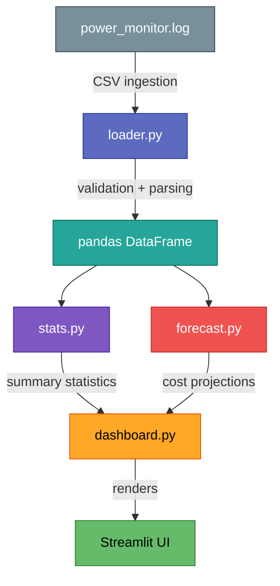

# Power Cost

Analyse real laptop power consumption logs and forecast the monthly
electricity cost of running the machine 24/7.

## Features

- Reads per-minute CSV data from an external power monitor
  (`Timestamp`, `CPU_Watts`, `GPU_Watts`).
- Computes descriptive statistics (mean, median, min, max, std) for
  CPU, GPU, and total power draw.
- Forecasts monthly energy consumption (kWh) and cost (USD), accounting
  for PSU efficiency.
- Interactive Streamlit dashboard with Plotly charts:
  - Power over time (CPU / GPU / Total)
  - CPU vs GPU scatter
  - Hourly distribution
  - Cost forecast indicators
- Configurable electricity rate and PSU efficiency via the sidebar.

## Prerequisites

- **Python 3.11+**
- **uv** -- fast Python package manager

Install uv if you do not already have it:

```bash
curl -LsSf https://astral.sh/uv/install.sh | sh
source $HOME/.local/bin/env
```

To make `uv` permanently available, add this line to your `~/.bashrc`
or `~/.zshrc`:

```bash
echo 'source $HOME/.local/bin/env' >> ~/.bashrc
```

Skip the Streamlit welcome/email prompt:

```bash
mkdir -p ~/.streamlit
cat > ~/.streamlit/credentials.toml << 'EOF'
[general]
email = ""
EOF
```

## Quick Start

```bash
# Clone and enter the repository
git clone git@github.com:ezetina86/power_cost.git
cd power_cost

# Activate uv (skip if already in your shell profile)
source $HOME/.local/bin/env

# Install dependencies
uv sync

# Run the dashboard
uv run streamlit run power_cost/app.py

# Run the test suite
uv run pytest
```

## Project Layout

```
power_cost/
    app.py              Streamlit entry point
    cli.py              CLI entry point (placeholder)
    config.py           Settings and constants
    data/
        loader.py       CSV ingestion and validation
        models.py       Data models / schemas
    analysis/
        stats.py        Descriptive statistics
        forecast.py     Cost forecasting logic
    ui/
        dashboard.py    Streamlit page components
        charts.py       Plotly chart builders
tests/
    conftest.py         Shared fixtures
    test_loader.py      Loader tests
    test_stats.py       Statistics tests
    test_forecast.py    Forecast tests
```

## Architecture



## Configuration

Key settings live in `power_cost/config.py`:

| Setting                    | Default        | Description                        |
|----------------------------|----------------|------------------------------------|
| `LOG_PATH`                 | (see config)   | Path to the power monitor CSV log  |
| `ELECTRICITY_RATE_PER_KWH` | `0.1587`       | USD per kWh (incl. TVA adjustment) |
| `PSU_EFFICIENCY`           | `0.90`         | Laptop PSU efficiency (0-1)        |
| `HOURS_PER_MONTH`          | `720`          | Hours assumed per billing cycle     |

All values can also be adjusted at runtime in the Streamlit sidebar.

## Technology Stack

| Layer           | Choice     |
|-----------------|------------|
| Language        | Python 3.12+ |
| Package Manager | uv         |
| UI / Dashboard  | Streamlit  |
| Data Processing | pandas     |
| Visualisation   | Plotly     |
| Testing         | pytest     |
| Linting         | ruff       |
| Type Checking   | mypy       |

## License

Private project.
